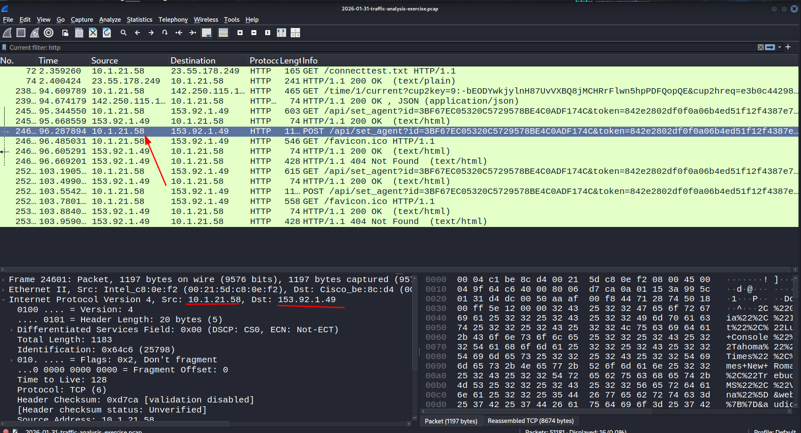
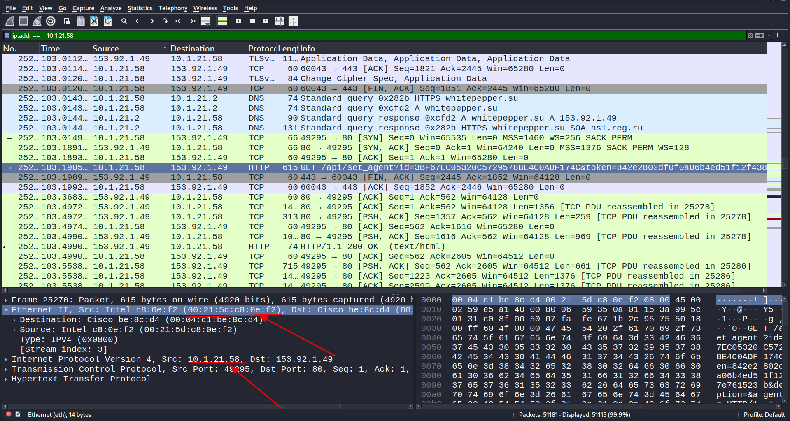
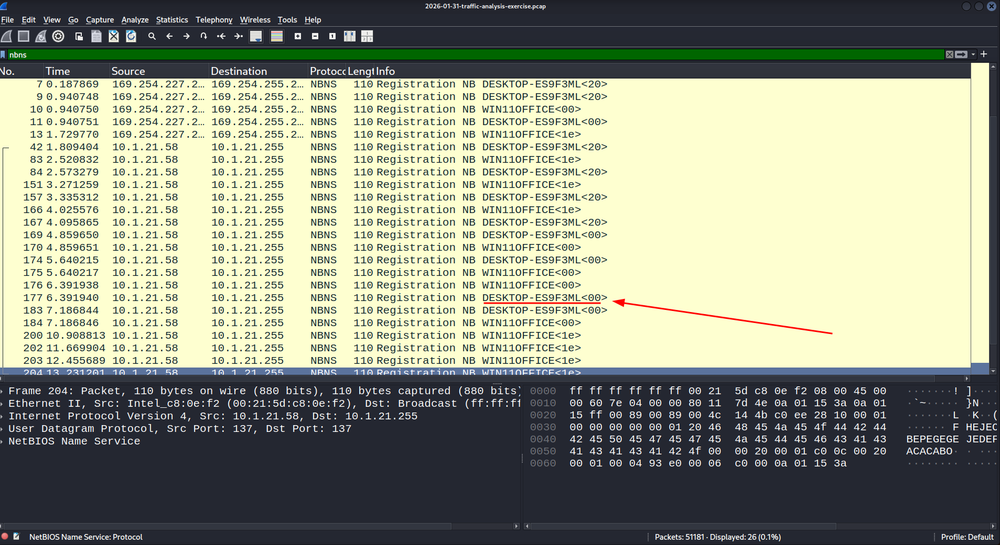
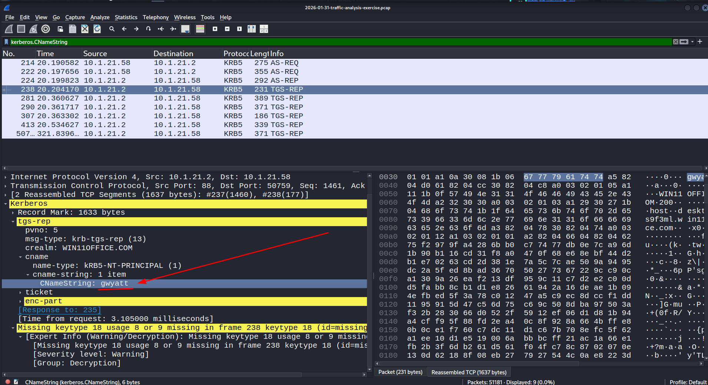
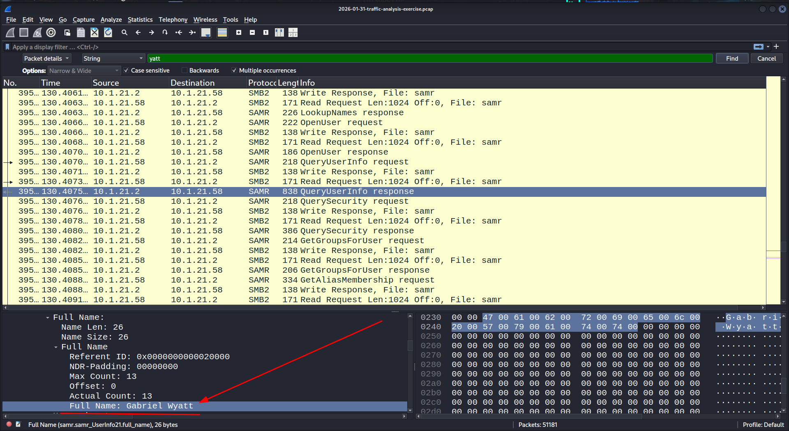
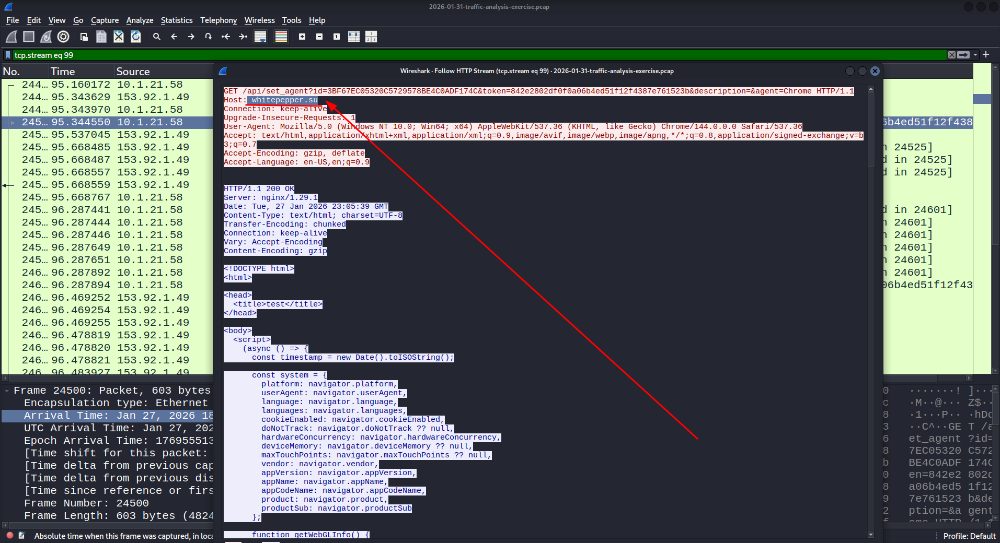

Naming convention:
    
# Source of PCAP:
    Malware-Traffic-Analysis.net
# File Name:

    2026-01-31 Lumma Stealer Malware

# Zip file password:
infected_20260131

# SCENARIO
- LAN Segment range:
   10.1.21.0/24 
   10.1.21.0 - 10.1.21.255

- Domain:
    win11office

-AD environment:
    WIN11OFFICE

- Domain Controller:
    10.1.21.2 -WIN-LU4L24X3UB7
  
- LAN Segment gateway:
    10.1.21.1

- LAN segment broadcast address:
    10.1.21.255

#   OBJECTIVES 
1.What is the IP address of the infected windows client?

    10.1.21.58

2.What is the MAC address of the infected windows client?

    00:21:5d:c8:0e:f2

3.What is the host name of the infected windows client?
    DESKTOP-ES9F3ML 

4.What is the user account from the infected windows client?
    gwyatt
    

5.What is the full name from the user account?
    Gabriel Wyatt

6.What is the domain from 153.92.1.49 that triggered the alert for lumma stealer?
     whitepepper.su

# ANALYSIS

(i) - IP address of the infected windows client

Now that we know that the C2 is operating on the IP address 153.92.1.49 we need to monitor any traffic running on http i.e not encrypted to know what communication happened to which hosts communicated to that ip.

Here we can identify HTTP traffic to that c2 ip, the ip is "10.1.21.58"

(ii) - MAC address of the infected windows client

Now that we have the Ip of the infected windows client Its easier to identify its MAC address,using the filter for out specific ip "ip.addr == 10.1.21.58" we can easily go through transmission.

The Infected client mac address is : "00:21:5d:c8:0e:f2" which is an  Intel_c8:0e:f2

(iii) - Host name of the infected windows client

To Identify the hostname we use the filter "nbns" which simply gives us the hostname

We are able to identify the hostname to be:
    DESKTOP-ES9F3ML 

(iv) - User account of the infected windows client
To identify the user account in the infected client we use the filter "kerberos.CNameString " and pick the value in it which is:
    gwyatt

(v) - Full name of user account 

To identify full name of the user acount logged into the windows client we use string search with the following:
    Ctrl + F 
    Config:
    ✅ case sensitive
    ✅ Multiple occurences
    packet details
    String

Found the  full username to be:
    Gabriel Wyatt

(vi) - 

To identify the domain which triggered the alert,we simply need  to identify the domain which our windows client was sending data to over HTTP:

We identify the domain to be:
     whitepepper.su

