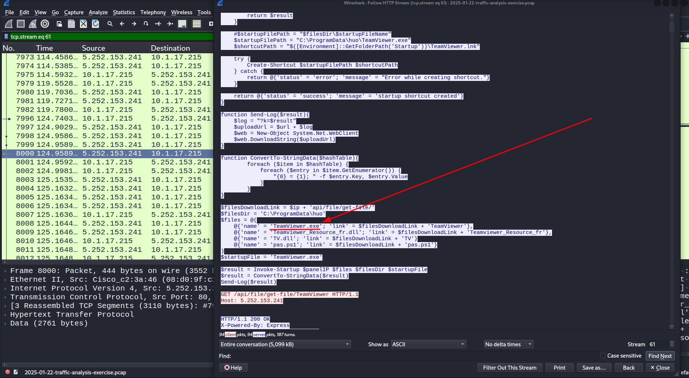
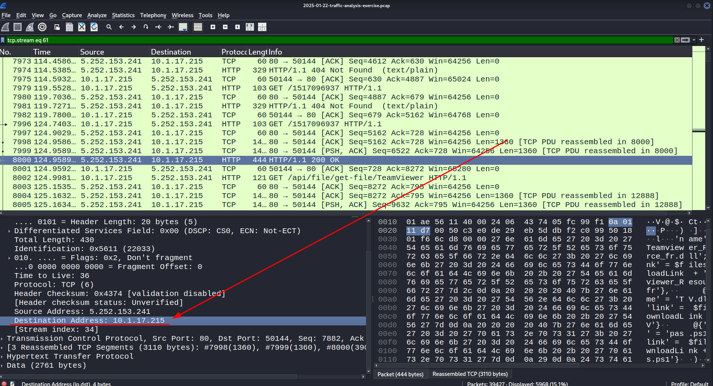
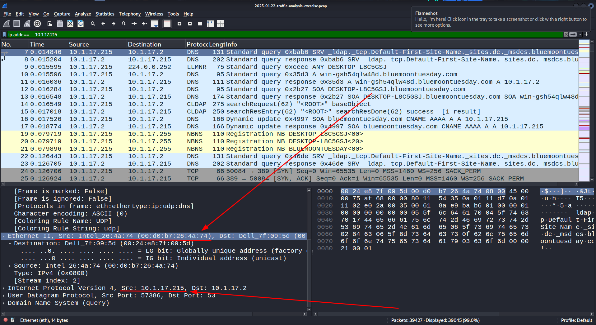
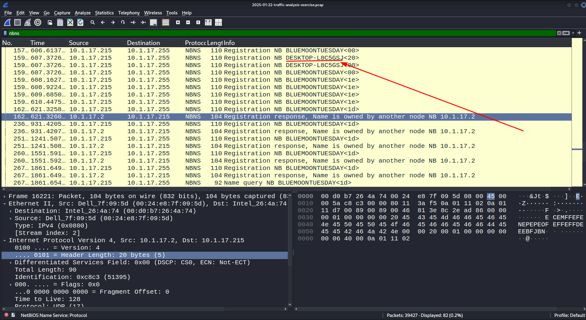
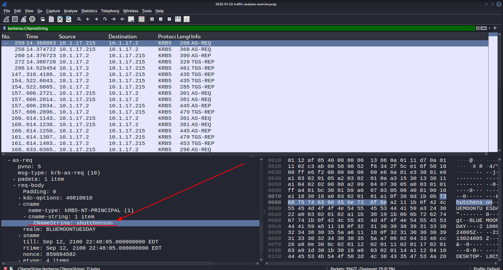
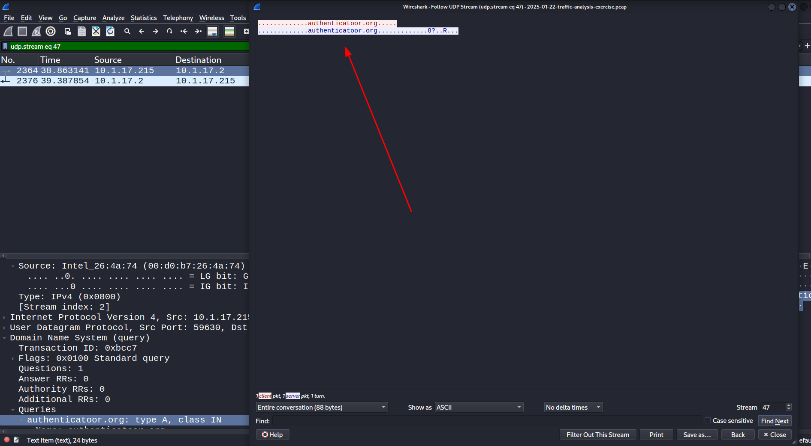
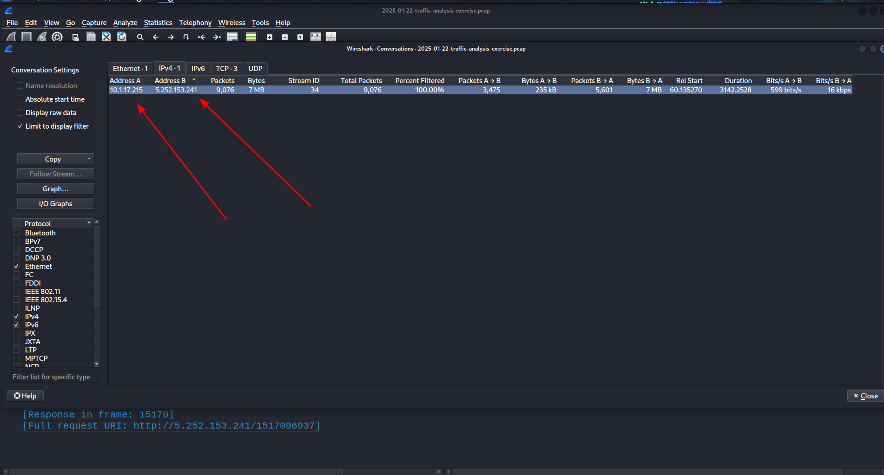
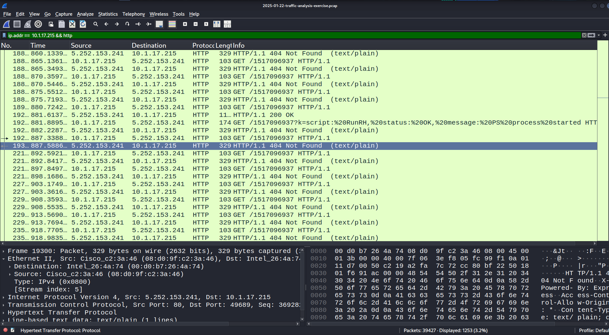
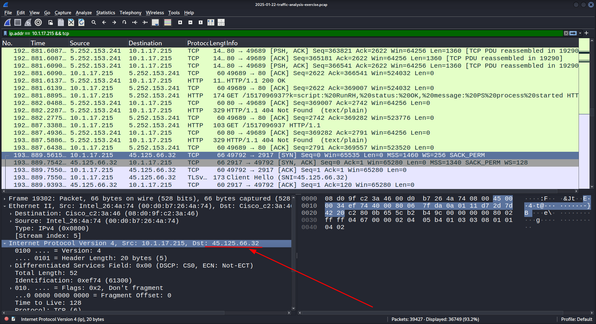

# Source of PCAP:
    Malware-Traffic-Analysis.net
# File Name:

 2025.01.22
 
# Zip file password:
infected_20250122

# SCENARIO
- LAN Segment range:
    10.1.17.0/24 
    (10.1.17.0 - 10.1.17.255) 

- Domain:
    bluemoonteusday.com

- Active Directory(AD) controller:
    10.1.17.2 - WIN-GSH54QLW48D

- AD environment name:
	DESKTOP-L8C5GSJ

- LAN Segment gateway:
    10.1.17.1
    

- LAN segment broadcast address:
    10.1.17.255

#   OBJECTIVES 
1. What is the IP address of the infected windows client?
    10.1.17.215 //

2. What is the mac address of the infected windows client?
    00:d0:b7:26:4a:74 //
    

3.  What is the hostname of the infected windows client?
	DESKTOP-L8C5GSJ

4.  What is the account name from the infected windows client?
    shutchenson //

5.  what is the likely domain name for the fake Authenticator page?
    ip -  5.252.153.241

6. What are the IP addresses used for c2 servers for this infection?
    5.252.153.241

# ANALYSIS

The user was compromised by downloading a file disguised as google authenticator.

(i) - IP of the infected windows client

To identify the IP of the infected windows we use the filter "http" to identify web unecrypted traffic and we find-out that the user on "10.1.17.215" downloaded a .exe file called "TiemViewer.exe" so the infected client is:
    10.1.17.215

(ii) - MAC address of the infected client

Now to identify the MAC address of the infected client we  use ip filter "ip.addr ==   10.1.17.215"  monitor its frames and identify the MAC address to be: 
    00:d0:b7:26:4a:74

(iii) - Hostname of the Infected windows client

To identify hostname of the infected hostname we use the filter "nbns" and identify hostname to be:
    BLUEMOONTUESDAY

(iv)    - Account Name of the infected windows client

Now to identify the account of the infected client we use the filter "kerberos.CNameString" which gives us client name.We identify the account name to be:
    shutchenson

(v) - Likely Domain of the fake authenticator page

Now to identify the likely domain of the authenticator page we use "dns" as filter which we will be able to see what Domain Name were resolved:

(vi)    -   IP addresses of the c2 used for the infection 

Here we need to analyze the conversations invloved with our client which is:

and the ip is:

Over HTTP we identify our client was commuicating to:
    5.252.153.241

Over TCP we identify that our host created a session with:
    45.125.66.32

